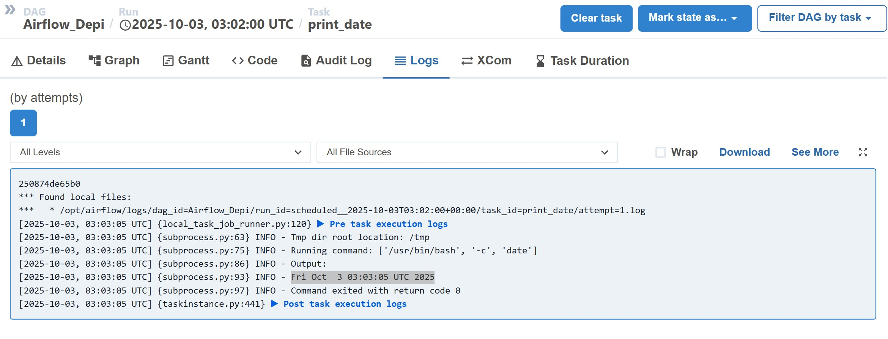

# 🌀 Airflow DAG Project  

This project demonstrates how to set up Apache Airflow with Docker, create a simple DAG, and run tasks successfully.  

---
## 📋 Table of Contents
- [Prerequisites](#prerequisites)
- [Project Overview](#project-overview)
- [Setup Instructions](#setup-instructions)
- [DAG Implementation](#dag-implementation)
- [Execution & Results](#execution--results)
- [Troubleshooting](#troubleshooting)

---

## 🚀 Step 1 – Start Airflow with Docker  

1. Create a new folder and add the provided **docker-compose.yaml** file.  
2. Open **PowerShell** (make sure you are in the project folder).  
3. Run the following commands:  

```bash
docker compose up airflow-init
```
```bash
docker compose up -d
```


##
### Second step:
1. Verify all containers are running:
```bash
docker ps
```

2. Open your browser and navigate to: **http://localhost:8080**

3. Log in with the default credentials:
   - **Username**: `airflow`
   - **Password**: `airflow`

_you will find these info in project's yaml file_
##
### 📝 Third step:

create dagfile.py in dags folder , in this file you do the imports and write the dag and the tasks 

in my project i made 3 tasks


| Task | Operator | Description |
|------|----------|-------------|
| **task1** | BashOperator | Prints the current date and time |
| **task2** | PythonOperator | Displays a personalized welcome message |
| **task3** | PythonOperator | Generates a random number and writes to `/tmp/random.txt` |
 

at the end of the script i ordered the tasks like this:

task1 >> task2 >> task3

#
### Forth step:
go to airflow home page and refresh, you will find a dag with the dag id you typed in the script.


### Finally:

1. **Unpause** the DAG by clicking the toggle switch
2. Navigate to the **Graph** view to visualize task dependencies

✅ you will find that all the three tasks are running successfully


##

#### output of the task 1:


##

#### output of the task 2:

##

#### output of the task 3:


To verify Task 3 output, check the file inside the container:


##

## 🛑 Stopping the Project

To stop all Airflow services:

```bash
docker compose down
```

To stop and remove all volumes (complete cleanup):

```bash
docker compose down -v
```

---

## 🙏 Acknowledgments

Special thanks to ENG Mohamed Hamed for their guidance
